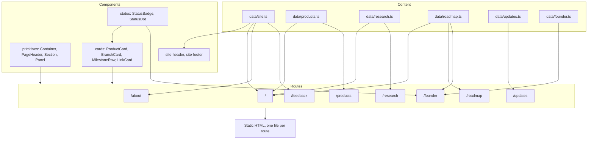

# Site architecture

## Shape



## Rules

**Content is data, not markup.** Anything that states a fact about ME lives in
`data/`. A page decides how it looks, never what it says. That is why the product
status labels are a TypeScript union: an invented status fails the build rather
than shipping.

**One fact, one place.** The homepage, the products page, and the founder console
all read the same product and milestone records. Changing a status changes it
everywhere at once.

**Components are shapes, not pages.** `ProductCard` knows how a product looks. It
does not know which page it is on or how many siblings it has.

**Static by construction.** There are no API routes, no server actions, no data
fetching, and no client state beyond the header's active link. Every route
prerenders to HTML at build time. This is a deliberate constraint, not an
optimization: a site with no server surface has no server surface to attack.

## The public and internal boundary

The public site and the future internal command center are separate systems that
share nothing at runtime.

```
                      ┌──────────────────────────────┐
   anyone ───────────▶│  www: this site              │
                      │  static HTML, no accounts    │
                      │  no reads from ME systems    │
                      └──────────────────────────────┘

                      ┌──────────────────────────────┐
   ME staff ─────────▶│  command.*: not built yet    │
   (authenticated)    │  separate host, separate repo│
                      └──────────────────────────────┘
```

The founder page is the one place where the two could blur, so it is explicitly
constrained: its numbers are illustrative summaries of already published project
state, it declares that on the page, and it holds no link to any live system.

## Design system

Tokens are defined once in `app/globals.css` under Tailwind's `@theme`, which
generates the utility classes used everywhere: `bg-surface`, `text-muted`,
`border-line`, and so on.

- One accent colour, `--color-accent`, used for small marks and links only.
- Three text weights: `text` for content, `muted` for secondary prose, `faint` for
  labels. All three pass AA on every surface they appear on.
- Structure comes from hairline borders and a faint masked grid, not gradients.
- Motion is one 0.5s entrance rise plus a slow status pulse, both removed under
  `prefers-reduced-motion`.

The founder route reuses the same tokens but composes them differently: bracketed
panel corners, monospace labels, status dots, and progress bars. That is what makes
it read as a console without introducing a second design system.

## Adding content

- A new product: add a record to `data/products.ts`. It appears on `/products`, and
  on the homepage if its slug is listed in the featured array in `app/page.tsx`.
- A new research branch: add a record to `data/research.ts`. It appears on
  `/research` and in the homepage technology grid, and its slug becomes the anchor
  the homepage links to.
- A new milestone: add a record to `data/roadmap.ts`. Complete and in progress
  entries also surface on the homepage and the founder console.
- A new update: add a record to `data/updates.ts`. Entries sort by date, newest
  first.
